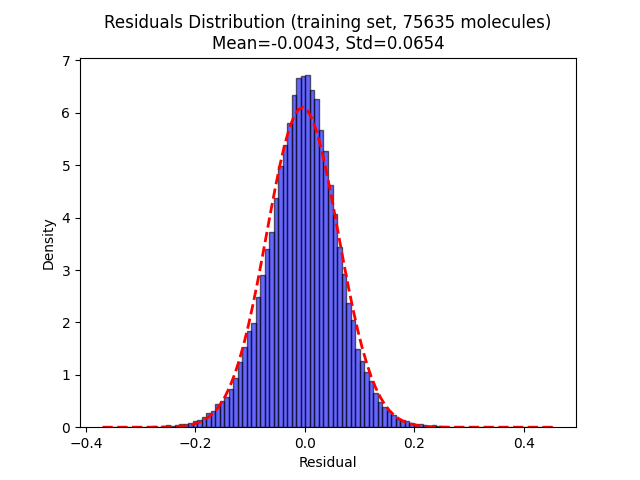
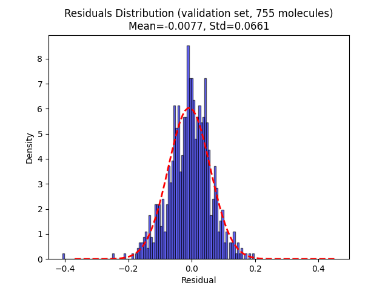

# Total Atomization Energy (TAE) model

Project in progress. Small attention based Graph Neural Network model (GNN) with sum pooling for the prediction of TAE for molecules.

It respects equivariance and extensivity.

The model has been trained on the [MSR-ACC/TAE25 dataset](https://zenodo.org/records/15783826) (77k coupled cluster atomization energies for broad chemical space) from 
Microsoft Research Accurate Chemistry Collection.
The training/validation sets used are the ones provided on the dataset website.

## Getting Started

You can download and go through example.ipynb to see how to use the model.

## Statistics of the results for the v0 model

Residual = tae_predicted - tae_exact

### Dependencies

* Have pytorch (tested with v2.7.0), dataclasses and math installed.

## Authors

Contributors names and contact info

[Lionel Lacombe](https://github.com/liolacombe)
